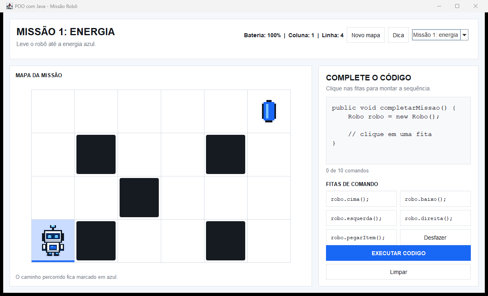

# Missão Robô: POO com Java

Jogo feito com Java Swing para apresentar Programação Orientada a
Objetos de forma visual e interativa.

O jogador monta um pequeno método Java usando fitas de comando. Ao executar, o
objeto `robo` percorre o mapa, desvia das paredes e tenta coletar a energia.



## Como executar

### Requisitos

- JDK 17 ou superior
- Windows, Linux ou macOS com interface gráfica

No Windows, execute `run.bat`. O arquivo compila e abre o jogo automaticamente.

Também é possível executar pelo terminal:

```powershell
javac -encoding UTF-8 -d out src\mostra\*.java
java -cp out mostra.Main
```

## Como jogar

1. Escolha uma missão.
2. Clique nas fitas para montar o método `completarMissao()`.
3. Use **Desfazer** ou **Limpar** para corrigir a sequência.
4. Clique em **Executar código**.
5. Leve o robô até a energia e termine com `robo.pegarItem();`.

As paredes mudam quando o botão **Novo mapa** é usado. Todo mapa sorteado possui
uma solução que cabe no limite de dez comandos.

## Fitas disponíveis

```java
robo.cima();
robo.baixo();
robo.esquerda();
robo.direita();
robo.pegarItem();
```

## Onde está a POO

- **Classe:** `Robo` define os dados e comportamentos de um robô.
- **Objeto:** `Robo robo = new Robo();` cria uma instância da classe.
- **Atributos:** posição, direção, bateria e estado da coleta.
- **Métodos:** `cima()`, `direita()` e `pegarItem()` representam ações.
- **Encapsulamento:** os atributos são privados e mudam somente pelos métodos.
- **Enums:** `Direcao` e `Comando` limitam o programa a opções válidas.

## Lógica por trás do jogo

Quando uma fita é clicada, seu `Comando` entra em uma lista. A interface usa
essa lista para mostrar o código Java na tela.

Durante a execução, cada movimento segue este fluxo:

```text
comando escolhido
      ↓
calcular a próxima posição
      ↓
verificar limite e parede
      ↓
alterar o objeto Robo
      ↓
animar o sprite e marcar o caminho
```

O mapa usa uma grade de 6 colunas por 4 linhas. Internamente, o canto superior
esquerdo é a posição `(0, 0)`. Na interface, linhas e colunas aparecem começando
em 1 para facilitar a leitura.

### Paredes aleatórias

Depois de sortear as paredes, `Missao` executa uma busca em largura, conhecida
como BFS. O mapa só é aceito quando a busca encontra um caminho de até nove
movimentos. Assim sobra o décimo comando para `robo.pegarItem();`.

### Animação

`PainelMapa` interpola a posição visual entre duas casas. O sprite mostra:

- costas ao subir;
- frente ao descer;
- perfil ao andar para os lados;
- animação `idle` enquanto está parado.

Cada casa visitada recebe uma marca azul para mostrar o caminho executado.

## Estrutura do projeto

```text
src/mostra/
├── Main.java            inicia a aplicação
├── JogoRoboFrame.java   monta a interface e executa os comandos
├── PainelMapa.java      desenha o mapa, a trilha e as animações
├── Missao.java          cria as missões e sorteia paredes válidas
├── Robo.java            guarda o estado e os métodos do robô
├── Posicao.java         representa uma coordenada
├── Direcao.java         define os quatro movimentos possíveis
├── Comando.java         liga cada fita ao código Java
└── SpriteRobo.java      gera os sprites em pixel art
```

## Testes

No Windows:

```powershell
.\run-tests.bat
```

Os testes verificam movimentos, consumo de bateria, coleta única e centenas de
mapas aleatórios.

## Apresentação

A apresentação curta usada na mostra está em
[Apresentacao-POO-com-Robo.pptx](Apresentacao-POO-com-Robo.pptx). Os GIFs são
reproduzidos no modo de apresentação do PowerPoint.
